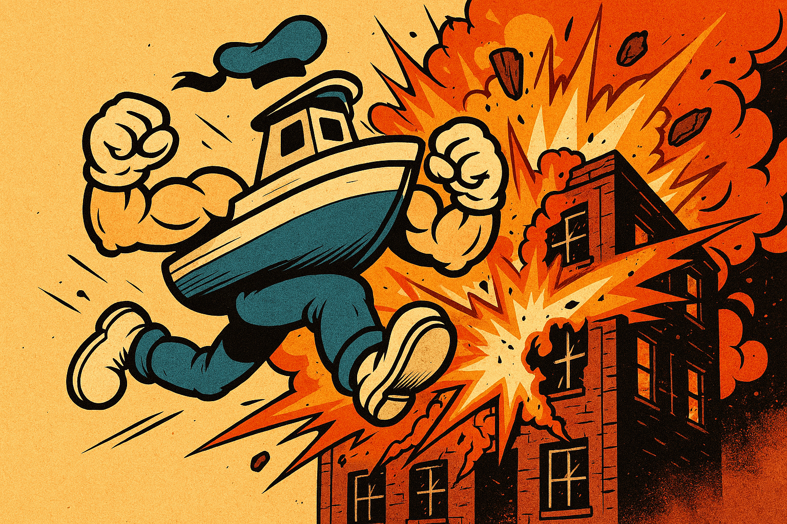

# 🚢 Boatry McBoaterson

A muscular boat survives waves of fish enemies on the open ocean. Vampire Survivors-style gameplay with an ocean twist.



## 🎮 Play Now
- **Web version**: [Play in browser](https://skyeatsbrad.github.io/Boatry-McBoaterson/) (works on any device including iPhone/Android)
- **Windows**: Download from [Releases](https://github.com/skyeatsbrad/Boatry-McBoaterson/releases)

## Features

### Gameplay
- **4 Boat Classes**: Tugboat (cannon), Warship (AoE blast), Speedboat (boomerang), Sailboat (lightning)
- **8 Fish Enemies**: Piranha, Pufferfish, Swordfish, Jellyfish, Electric Eel, Anglerfish, Shark + **Kraken Boss**
- **4 Weapon Types**: Cannon, Chain Lightning, Anchor Boomerang, AoE Explosion
- **Dash Ability**: SPACE to dodge with invulnerability frames
- **Destroyable Items**: Crates, barrels, buoys drop bonus XP, gold, or power-ups
- **14 Power-ups**: Damage, speed, multi-shot, orbital blades, aura, and more
- **Combo System**: Chain kills for XP/gold multipliers (Bronze → Diamond tiers)

### Ocean Hazards
- **Whirlpools** that pull you in
- **Storms** that reduce visibility and shake the screen
- **Whale & Dolphin allies** that swim by and attack enemies

### Progression
- **Persistent Upgrades**: Spend gold on Vitality, Power, Agility, Wisdom
- **6 Animated Skins**: Flame, Electric, Golden, Ghost, Ice (unlock after 5 games)
- **16 Achievements**: First Blood, Boss Slayer, Combo King, Storm Chaser, and more
- **High Score Leaderboard**
- **Ship Log / Bestiary**: Track all enemies encountered

### Game Modes
- **Normal**: Classic wave survival
- **Boss Rush**: Only bosses, escalating difficulty
- **Speed Run**: 5-minute timer, maximize kills
- **Daily Challenge**: Date-seeded run for competitive play

### Multiplayer
- **Local Co-op**: 2-player same-screen (P2: IJKL + Right Shift, or controller 2)
- Dynamic camera zooms to keep both players in view

### Accessibility
- **Colorblind Mode**: Shape symbols on all enemies
- **Game Speed Slider**: 0.5x to 1.5x
- **Screen Reader**: TTS support for menus
- **Haptic Feedback**: Vibration on mobile devices

### Platforms
| Platform | Method | Status |
|----------|--------|--------|
| Web (all devices) | Pygbag / Godot web export | ✅ |
| Windows | Godot .exe / PyInstaller | ✅ |
| Android | Godot APK sideload | ✅ |
| Steam Deck | Godot Linux build | ✅ |
| iOS | Web version in Safari | ✅ |

## Controls
- **WASD / Arrow Keys** — Move
- **SPACE** — Dash
- **Esc** — Pause
- **F11** — Fullscreen
- **F3** — FPS / Performance overlay
- **1/2/3** — Select power-ups on level up
- **Touch** — Virtual joystick on mobile

## Project Structure
```
├── game.py              # Pygame version (standalone)
├── updater.py           # Auto-update from GitHub Releases
├── web/                 # Pygbag web build
├── godot/               # Godot 4 port (full version)
│   ├── project.godot
│   ├── scenes/          # All .tscn scene files
│   ├── scripts/         # GDScript source
│   │   ├── autoload/    # GameManager, AudioManager, AchievementManager
│   │   ├── player/      # Player, weapons, skins
│   │   ├── enemies/     # Fish types, Kraken boss, spawner
│   │   ├── items/       # Gems, health, chests, floating items
│   │   ├── ui/          # All menu screens
│   │   ├── coop/        # Co-op manager, camera
│   │   ├── game_modes/  # Mode manager, combo, bestiary
│   │   ├── mobile/      # Touch controls, haptics
│   │   ├── accessibility/ # Colorblind, speed, screen reader
│   │   ├── effects/     # Particles, screen shake, damage numbers
│   │   ├── hazards/     # Whirlpool, ocean allies
│   │   └── weather/     # Storm system
│   └── assets/
│       ├── shaders/     # Ocean, skin effects, damage flash
│       └── sprites/     # (procedural — no files needed)
└── builds/              # Export output
```

## 📥 How to Install & Play

### 🌐 iOS (iPhone / iPad)
No install needed! Open this link in Safari:

**[https://skyeatsbrad.github.io/Boatry-McBoaterson/](https://skyeatsbrad.github.io/Boatry-McBoaterson/)**

To add it to your home screen like an app:
1. Open the link in **Safari**
2. Tap the **Share** button (box with arrow)
3. Tap **"Add to Home Screen"**
4. It now appears as an app icon — runs fullscreen, no browser bar

### 🪟 Windows
1. Go to [**Releases**](https://github.com/skyeatsbrad/Boatry-McBoaterson/releases)
2. Download **`Survivor.zip`**
3. Extract the zip (right-click → Extract All)
4. Double-click **`Survivor.exe`** — that's it, single file, no install needed

> First time only: if you get a "Bad Image" error, run **`Play Survivor.bat`** as administrator — it installs the Visual C++ runtime, then you can use `Survivor.exe` directly from then on.

### 🤖 Android
1. Go to [**Releases**](https://github.com/skyeatsbrad/Boatry-McBoaterson/releases) on your phone
2. Download **`Survivor.apk`**
3. Open the APK — if prompted, tap **"Settings"** and enable **"Install from unknown sources"** for your browser
4. Tap **Install**
5. Open **Boatry McBoaterson** from your app drawer

> No Google Play Store needed. Works on any Android 6.0+ device.

### 🎮 Steam Deck
**Option A — Desktop Mode (easiest):**
1. Switch to **Desktop Mode** (hold Power → Desktop Mode)
2. Open the browser, go to [**Releases**](https://github.com/skyeatsbrad/Boatry-McBoaterson/releases)
3. Download **`Survivor.x86_64`** (Linux build)
4. Open a terminal (Konsole) and run:
   ```bash
   chmod +x ~/Downloads/Survivor.x86_64
   ~/Downloads/Survivor.x86_64
   ```

**Option B — Add to Steam as Non-Steam Game:**
1. Download `Survivor.x86_64` as above
2. In Steam, click **"Add a Game"** → **"Add a Non-Steam Game"**
3. Browse to `Survivor.x86_64` and add it
4. Now it appears in your Steam library and works in **Gaming Mode** with controller support

**Option C — Web version:**
Just open the browser in Desktop Mode and go to the web link above.

### 🌐 Any Device (Web Version)
Works on anything with a browser — PC, Mac, Linux, Chromebook, tablet, phone:

**[https://skyeatsbrad.github.io/Boatry-McBoaterson/](https://skyeatsbrad.github.io/Boatry-McBoaterson/)**

No downloads, no installs, plays instantly.

---

## 🛠️ Development
**Pygame version** (quick play):
```
pip install pygame
python game.py
```

**Godot version** (for development/modding):
1. Install [Godot 4.3+](https://godotengine.org/download)
2. Open `godot/project.godot`
3. Press F5 to run

> **Note**: Players do NOT need Godot installed. The Releases page has pre-built standalone executables for each platform. Godot is only needed if you want to modify the game's source code.

## License
Made with ❤️ by skyeatsbrad
